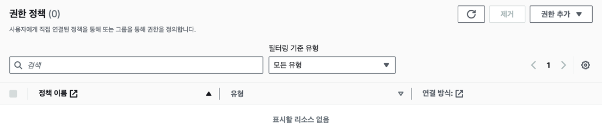
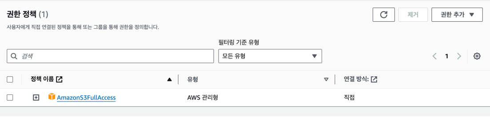

#

유저에 정책(권한)을 부여함으로써 특정 리소스에 접근할 수 있도록 합니다.

### 테스트 코드

```typescript
const client = new S3Client({
  region: 'ap-northeast-2',
  credentials: {
    accessKeyId: process.env.AWS_ACCESS_KEY_ID,
    secretAccessKey: process.env.AWS_SECRET_ACCESS_KEY,
  } as AwsCredentialIdentity,
});

const params = {
  /** input parameters */
};
const command = new ListBucketsCommand(params);
try {
  console.log(await client.send(command));
} catch (e) {
  console.log(e);
}
```

### 유저에 권한이 없는 경우

access denied 에러가 발생합니다.

```terraform
variable "user_cloud_vault_policy_arn_list" {
  default = [
  ]
}
```



### 유저에 권한이 있는 경우

정상적으로 응답을 받습니다.

```terraform
variable "user_cloud_vault_policy_arn_list" {
  default = [
    "arn:aws:iam::aws:policy/AmazonS3FullAccess",
  ]
}
```

